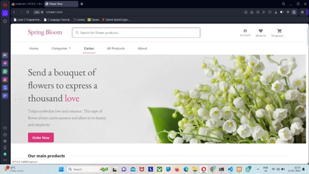
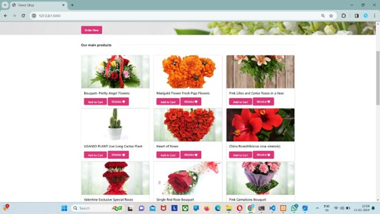
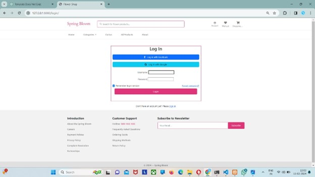
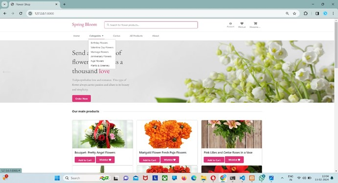
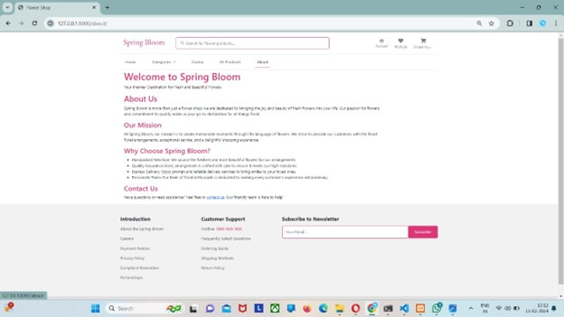
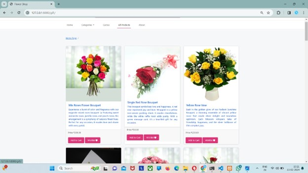
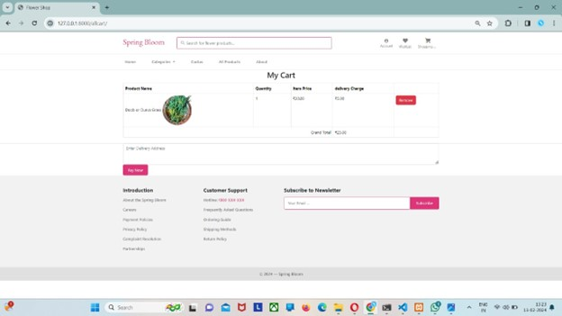
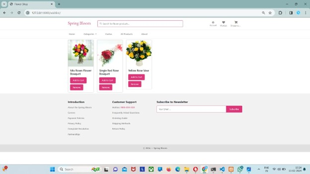

# Spring Bloom

The ultimate goal was to provide the flower shop with a dynamic online platform that enhances customer experience, drives sales, and fosters growth in the competitive digital landscape

The proposed system aims to develop an e-commerce website specifically tailored for a flower shop. The system will enable customers to browse a catalog of flower arrangements, bouquets, and related products, add items to their cart, and securely complete purchases online. Additionally, the system will provide backend functionalities for managing product listings, orders, payments, and inventory.The proposed system was chosen based on its ability to meet the specific requirements of the flower shop, including customization options, cost-effectiveness, and scalability. The alternative options were deemed less suitable due to limited flexibility and higher costs.

#FUTURE PLANS :- 
Enhanced User Experience: Continuously improve website design and navigation for ease of use.
Expanded Product Offerings: Introduce new flowers, plants, and accessories to attract diverse customers.
Personalization and Customization: Offer personalized recommendations and customizable options.
Improved Online Ordering: Streamline checkout, offer multiple payment options, and provide delivery tracking.
Digital Marketing and SEO: Invest in SEO, social media, and digital ads to boost visibility and reach.
Community Engagement and Sustainability: Engage with the local community and promote sustainable practices.
Data Analytics and Insights: Utilize analytics to track customer behavior, optimize offerings, and improve the shopping experience.

#CONCLUSION :-
Every flower has a meaning and our website will help you to choose flowers with a meaning and to love yourself and others . our motto is to spread love like a flower spreads it's fragrance around surroundings in everyone's life you will not only get a flower but also a beautiful message for you and your loved one's.
From classic blooms to exotic varieties, diversifying our offerings ensures every visitor finds their perfect petal. 

